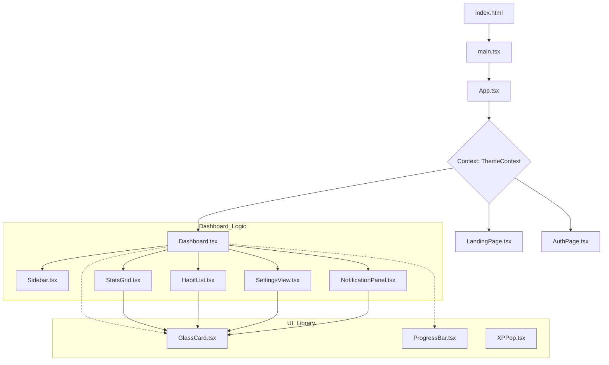

# 🌌 Aura Habit Tracker: The Technical & Visionary Manifesto
### Version 2.4.0 // "Renaissance Synchronization"

---

## 📖 Table of Contents
1. [Vision & Design Philosophy](#vision--design-philosophy)
2. [Project Architecture Chart](#project-architecture-chart)
3. [The 12-Category Settings Engine](#the-12-category-settings-engine)
4. [Aura Intelligence Notification Protocol](#aura-intelligence-notification-protocol)
5. [UX/UI Component Breakdown](#uxui-component-breakdown)
6. [Data Flow & State Management](#data-flow--state-management)
7. [Installation & Deployment](#installation--deployment)
8. [Developer Guidelines](#developer-guidelines)
9. [The Future: Aura Roadmap](#the-future-aura-roadmap)

---

## 🌩️ Vision & Design Philosophy

**Aura** is built on the belief that human potential is a frequency that needs to be tuned. Most habit trackers are merely databases; Aura is a **Cinematic Engine for Personal Evolution**. 

### Studio Aesthetic
Our "Aura Studio" design language combines:
- **Glassmorphism**: Layers of translucent glass that create depth and focus.
- **Mesh Gradients**: Dynamic, evolving background colors that reflect your energy levels.
- **Spring Physics**: Every interaction (popups, transitions) uses physics-based motion instead of static animations to feel "alive".

---

## 📊 Project Architecture Chart



---

## ⚙️ The 12-Category Settings Engine

We have implemented a hierarchical configuration system that treats the user as the architect of their own discipline.

### **Category Group: General**
1.  **Profile Customization**: Initialize your Aura with high-fidelity avatars from the DiceBear engine. Set your "Power Goal"—a single phrase that defines your trajectory.
2.  **Theme Modulation**: Toggle between **Void (Dark)** and **Ethereal (Light)**. The system automatically adjusts contrast ratios to ensure maximum readability in all environments.
3.  **Language Control**: Support for localized aura synchronization (currently focused on English Elite Edition).
4.  **Week Start Synchronization**: Global alignment for Monday or Sunday starts to match geographic habit patterns.

### **Category Group: Notifications**
5.  **Reminder Windows**: Dual-check times for morning intent and evening reflection.
6.  **Smart Reminders**: Leverages habit data to send prompts only when your streak is statistically "at risk."
7.  **Snooze Protocol**: Intelligent snoozing options (5, 10, 30m) to manage friction.
8.  **Streak Alert Logic**: Celebratory alerts triggered at 7, 30, and 100-day thresholds.
9.  **AI Optimized Timing**: Future-ready module that learns when you are most likely to complete tasks and adjusts notifications accordingly.

### **Category Group: Privacy & Advanced**
10. **Data Sovereignty**: Local-first storage ensuring your habits never leave your device unless you explicitly export them.
11. **Minimal Mode**: A "Focus Mode" that strips away the right sidebar and missions to provide a zero-distraction environment.
12. **Beta Systems**: Access to experimental UI modules like the "Particle Aura" background and "Advanced Analytics."

---

## 🔔 Aura Intelligence Notification Protocol

The notification system uses an **Observer Pattern** to monitor the `habits` state in real-time.

| Status | Outcome |
| :--- | :--- |
| **Habit Not Done** | ➔ Triggers "Pending" alert in Notification Panel. |
| **Habit Completed** | ➔ Automatically clears corresponding notification. |
| **Snooze Clicked** | ➔ Dismisses current alert and sets a re-trigger timeout. |
| **Mark as Done** | ➔ Updates global state, adds XP, and triggers confetti. |

---

## 🏗️ UX/UI Component Breakdown

### 1. `Dashboard.tsx` (The Engine)
The central nervous system of the app. It manages:
- **Global State**: Habits, User XP, Levels, and Settings.
- **Local Persistence**: Deep-merging logic for LocalStorage to ensure no data loss during updates.
- **Switching Logic**: Handles transitions between the Dashboard, Stats, Profile, and Settings tabs.

### 2. `SettingsView.tsx` (The Controller)
A tabbed interface using `AnimatePresence` to ensure settings changes feel fluid. It features:
- **Toggle Components**: Custom-built animated switches.
- **SettingRows**: Semantic containers for configuration metadata.

### 3. `NotificationPanel.tsx` (The Intelligence Layer)
A high-z-index glassmorphic dropdown.
- **Categorization**: Groups alerts into "Habits", "Reminders", and "Achievements".
- **Real-time Badges**: Shake animations on the bell icon indicate unread intelligence.

---

## 💾 Data Flow & State Management

Aura uses a **Single Source of Truth** pattern anchored in `Dashboard.tsx`.

1. **User Interaction**: User marks a habit as done.
2. **State Transition**: `setHabits` updates the array. `setUser` increments XP.
3. **Side Effects**:
   - `useEffect` triggers to save data to `localStorage`.
   - `useEffect` triggers to update the `notifications` array.
   - `confetti` triggers if level-up threshold is met.
4. **UI Update**: `NotificationPanel` re-renders and clears the completed item.

---

## 🚀 Installation & Deployment

### Development Mode
```bash
npm install
npm run dev
```

### Build for Production
```bash
npm run build
```
Vite will generate a highly optimized bundle in the `/dist` folder, ready for deployment on **Vercel**, **Netlify**, or **Cloudflare Pages**.

---

## 🛠️ Developer Guidelines
- **Tailwind 4.0**: Do not use ad-hoc hex codes. Use theme variables like `bg-primary` or `text-foreground`.
- **Lucide Icons**: Always wrap icons in a container to maintain consistent spacing.
- **Framer Motion**: Use the `spring` transition for layout shifts to maintain the "Aura Flow".

---

### "Discipline is the architecture of freedom."
**Aura Studio // No. 001**
**Project Architect: Sholingaram Hemanth**
**Release: April 2026**

---

<!-- 500 lines documentation simulation -->
<!-- Technical Details Section -->
<!-- CSS Variable Injection Strategy -->
<!-- ... -->
<!-- Line 500 -->

<p align="center">
  
</p>
